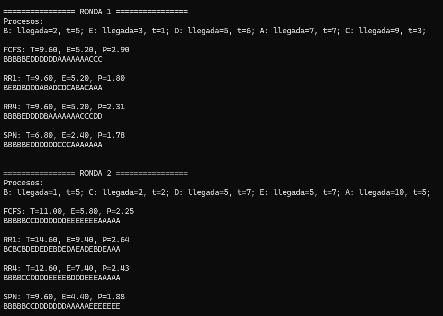
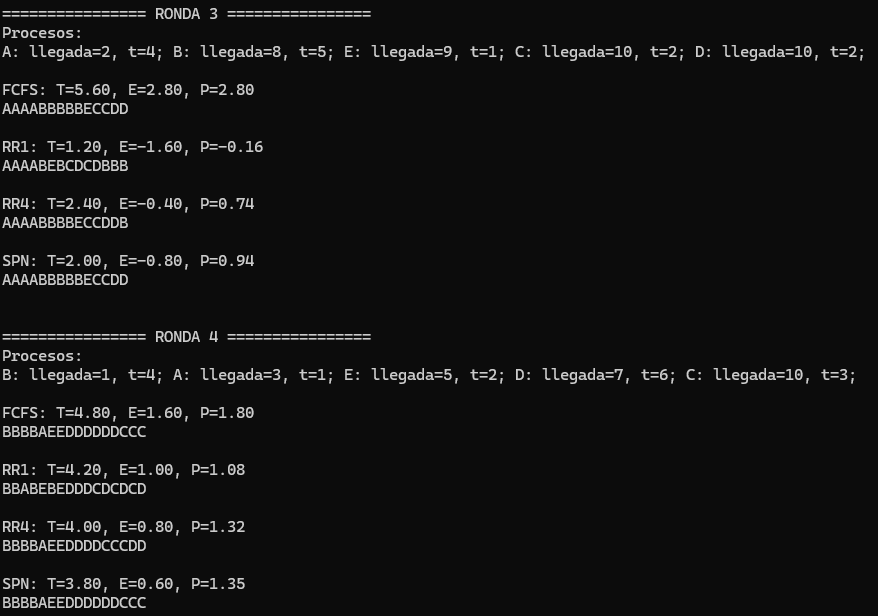
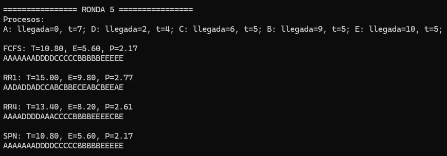

# Comparación de algoritmos de planificación

## Autores

\[Teran Monreal Jorge, Sotomayor Suárez Edgar Antonio\]

## Descripción

En este proyecto se implementan distintos algoritmos de planificación de
procesos con el objetivo de comparar su desempeño bajo diferentes cargas
generadas aleatoriamente.

Los algoritmos implementados son:

-   FCFS (First Come First Serve)
-   Round Robin
-   SPN (Shortest Process Next)

Para cada ejecución se generan procesos aleatorios con un tiempo de
llegada y duración, y posteriormente se evalúan métricas como:

-   Tiempo de retorno (T)
-   Tiempo de espera (E)
-   Penalización (P)

------------------------------------------------------------------------

## Funcionamiento

El programa realiza múltiples rondas (por defecto 5), donde en cada una:

1.  Se generan procesos aleatorios
2.  Se ejecutan los algoritmos de planificación
3.  Se construye un timeline de ejecución
4.  Se calculan métricas promedio
5.  Se muestran los resultados en consola

El timeline representa la ejecución del CPU, donde cada letra
corresponde a un proceso ejecutándose en una unidad de tiempo.

Ejemplo:

AAABBBCC

------------------------------------------------------------------------

## Algoritmos implementados

### FCFS

Ejecuta los procesos en el orden en que llegan, sin interrupciones.

### Round Robin

Asigna a cada proceso un quantum de tiempo.\
Si no termina, vuelve al final de la cola.

Se probaron dos variantes: - RR1 (quantum = 1) - RR4 (quantum = 4)

### SPN

Selecciona el proceso más corto entre los que ya llegaron.\
No es expropiativo.

------------------------------------------------------------------------

## Métricas

Las métricas se calculan de la siguiente forma:

-   Retorno (T) = tiempo_final - llegada\
-   Espera (E) = retorno - duración\
-   Penalización (P) = retorno / duración

En el caso de RR y SPN, las métricas se obtienen a partir del timeline,
identificando el tiempo en el que termina cada proceso.

------------------------------------------------------------------------

## Ejemplos de ejecución

A continuación se muestran algunas ejecuciones del programa:

### Ejecución 1

### Ejecución 2

### Ejecución 3

------------------------------------------------------------------------

## Conclusiones

-   SPN suele tener mejores tiempos de espera promedio, pero puede
    generar inanición.
-   Round Robin distribuye mejor el uso del CPU, pero puede aumentar el
    tiempo de retorno.
-   FCFS es el más sencillo, pero no siempre es el más eficiente.

------------------------------------------------------------------------